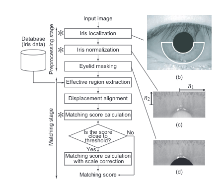

# Iris Recognition using Phase Based Matching

Course project for CS663. Based on the work of Kazuyuki Miyazawa and Koichi Ito - [An Iris Recognition System Using Phase-Based Image Matching](https://www.researchgate.net/publication/224057370_An_Iris_Recognition_System_Using_Phase-Based_Image_Matching).

## Overview

The chosen paper presents an implementation of iris recognition algorithm using phase-basedimage matching using the Phase Only Correlation Function of chosen image pairs.  Throughsome experimentation, we have tried to see what parameters suite best for CASIA data-set andalso given values for genuine detection accuracy and imposter detection accuracy.

We have implemented our algorithm as per the following pipeline -

  

A detailed report can be found [here](CS_663_Project_report.pdf)

### References -

- Miyazawa, Kazuyuki & Ito, Koichi & Aoki, Takafumi & Kobayashi, Koji & Katsumata, Akitoshi. (2006). An Iris Recognition System Using Phase-Based Image Matching. 325 - 328. 10.1109/ICIP.2006.313159.
- Miyazawa, Kazuyuki & Ito, Koichi & Aoki, Takafumi & Kobayashi, Koji & Nakajima, Hiroshi. (2008). An Effective Approach for Iris Recognition Using Phase-Based Image Matching. IEEE transactions on pattern analysis and machine intelligence. 30. 1741-56. 10.1109/TPAMI.2007.70833.
